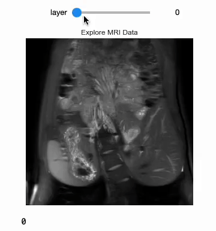
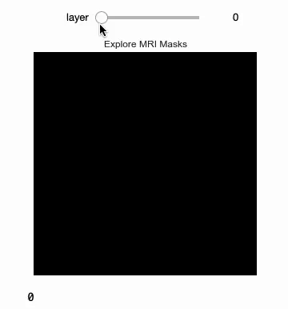
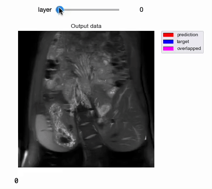
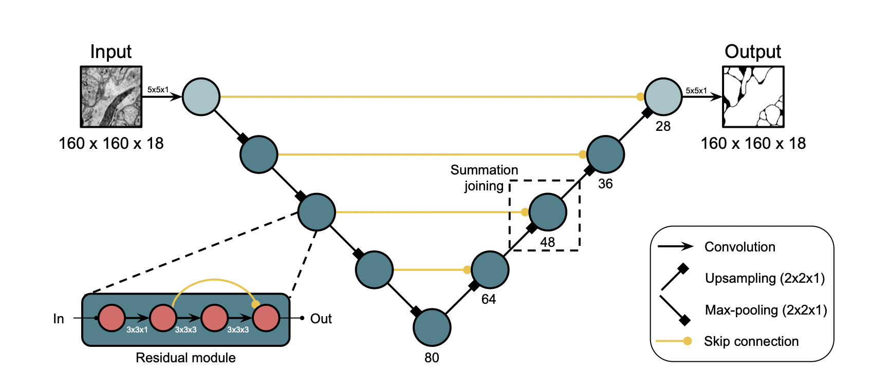

# 3D-CNN Segmentation
<a href="https://pytorch.org/"></a>
<a href="#"></a>
## Visualize Input and Mask

Data          |  Mask
:-------------------------:|:-------------------------:
  |  


## Output


---

- [Quick start](#quick-start)
- [Description](#description)
  - [Files](#files)
  - [Network](#network)
- [Usage](#usage)
  - [Training](#training)
  - [Prediction](#prediction)
- [Data](#data)
- [Reference](#reference)

## Quick start

1. Clone this repository
```
git clone https://github.com/joewong00/3D-CNN-Segmentation.git
```
2. Initialize local configuration and fetch data from submodule project ([surface distance](https://github.com/deepmind/surface-distance.git))
```
git submodule update --init
```
3. [Install CUDA](https://developer.nvidia.com/cuda-downloads)
4. [Install PyTorch](https://pytorch.org/get-started/locally/)
5. Install dependencies
```
pip install -r requirements.txt
```
6. Start with `main.ipynb` using Jupyter notebook or Google Colab

## Description
This model was trained from scratch with 50 3D kidney MRI and scored a [Dice coefficient](https://en.wikipedia.org/wiki/S%C3%B8rensen%E2%80%93Dice_coefficient) of 0.929516 on over 50 test MRI.

### Files:
- `main.ipynb`: Contains the main elements for data visualization, single data predicting and evaluation
- `train.py`: Script for model training
- `test.py`: Script for model testing
- `dataloader.py`: Custom dataset dataloading class
- `predict.py`: Script for predicting single image data and evaluation

### Network
**Reference: [wolny/pytorch-3dunet](https://github.com/wolny/pytorch-3dunet)**
#### 3D Residual UNet
Implementation based on https://arxiv.org/pdf/1706.00120.pdf


#### 3D UNet
Implementation based on [3D U-Net: Learning Dense Volumetric Segmentation from Sparse Annotation](https://arxiv.org/abs/1606.06650)


## Usage
**Note : Use Python 3.6 or newer**
### Training

```console
> python train.py -h
usage: train.py [-h] [--network NETWORK] [--batch-size N] [--epochs N]
                [--lr LR] [--gamma M] [--no-cuda] [--dry-run] [--seed S]
                [--log-interval N] [--save-model] [--checkpoint FILE]

PyTorch 3D Segmentation

optional arguments:
  -h, --help            show this help message and exit
  --network NETWORK, -u NETWORK
                        Specify the network (Unet3D / ResidualUnet3D)
  --batch-size N        input batch size for training (default: 1)
  --epochs N            number of epochs to train (default: 10)
  --lr LR               learning rate (default: 2.5e-4)
  --gamma M             Learning rate step gamma (default: 0.1)
  --no-cuda             disables CUDA training
  --dry-run             quickly check a single pass
  --seed S              random seed (default: 1)
  --log-interval N      how many batches to wait before logging training
                        status
  --save-model          For Saving the current Model
  --checkpoint FILE, -c FILE
                        Specify the path to the model
```
If a checkpoint exist, then use --checkpoint to specify the path to the checkpoint to continue training


### Prediction
- For test dataset, use `test.py`
- For single image testing, use `predict.py` or `main.ipynb`

After training your model and saving it to `checkpoints/model.pt`, you can easily test the output masks on your images via the CLI or `main.ipynb`

To predict a single image and compare result with its mask:
`python predict.py --network "ResidualUnet3D" --model 'checkpoints/model.pt' --input "./MRI1_T2.nii.gz" --mask "./MRI1_T2mask.nii.gz"`

```console
> python predict.py -h
usage: predict.py [-h] [--network NETWORK] [--model FILE] --input INPUT
                  [--mask INPUT] [--viz] [--no-save] [--no-cuda]
                  [--mask-threshold MASK_THRESHOLD]

Predict masks from input images

optional arguments:
  -h, --help            show this help message and exit
  --network NETWORK, -u NETWORK
                        Specify the network (Unet3D / ResidualUnet3D)
  --model FILE, -m FILE
                        Specify the path to the file in which the model is
                        stored (default:model.pt)
  --input INPUT, -i INPUT
                        Path to the image file (format: nii.gz)
  --mask INPUT, -l INPUT
                        Path to the ground truth of the input image
                        (if_available) (default:None)
  --viz, -v             Visualize the output (default:True)
  --no-save, -n         Do not save the output masks
  --no-cuda             disables CUDA testing (default: False)
  --mask-threshold MASK_THRESHOLD, -t MASK_THRESHOLD
                        Minimum probability value to consider a mask pixel
                        white (default: 0.5)
```

To predict the whole test dataset (with test dataloader):
`python test.py --network "ResidualUNet3D" --model "checkpoints/model.pt" --batch-size 1`

```console
> python test.py -h
usage: test.py [-h] [--network NETWORK] [--model FILE] [--batch-size N]
               [--no-cuda] [--mask-threshold MASK_THRESHOLD]

Evaluate using test loader

optional arguments:
  -h, --help            show this help message and exit
  --network NETWORK, -u NETWORK
                        Specify the network (Unet3D / ResidualUnet3D)
  --model FILE, -m FILE
                        Specify the paht to the file in which the model is
                        stored (model.pt)
  --batch-size N        input batch size for testing (default: 1)
  --no-cuda             disables CUDA testing (default: False)
  --mask-threshold MASK_THRESHOLD, -t MASK_THRESHOLD
                        Minimum probability value to consider a mask pixel
                        white (default: 0.5)
```


You can specify which model file to use with `--model model.pt`.

## Data
The input images and target masks (for training) should be in the `dataset/train/T2/` and `dataset/train/T2Masks/` folders respectively. Original dataset have 3D size (W * H * D), they are **preprocessed** by adding channel dimension and written into the [h5](https://www.hdfgroup.org/solutions/hdf5/) files for dataloading.

You can use your own dataset as long as you make sure it is loaded properly in `dataloader.py`.

---

## Reference: 
- [milesial/Pytorch-UNet](https://github.com/milesial/Pytorch-UNet)
- [wolny/pytorch-3dunet](https://github.com/wolny/pytorch-3dunet)